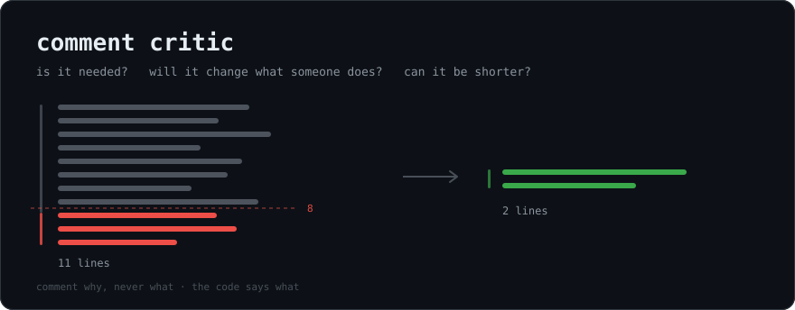

# comment-critic



A Claude Code plugin. One advisory hook: after any write, if a comment block runs longer than
8 lines, it says where and asks three questions — **is it needed, will it change what someone
does, can it be shorter?** It cannot judge. You answer.

Catches the write however it happened. `Write`, `Edit` and `MultiEdit` are read from the tool
payload; for `Bash` the hook asks `git` what actually changed, so a heredoc, `sed -i`, a `python3 -`
one-liner, a generator script and a brand-new untracked file are all caught the same way. Parsing
the command to guess which of those wrote what is unwinnable — there is always another `etc.`

## Languages

A marker is only a comment in the language that uses it, so they are never pooled: `#` opens a
comment in Python and a preprocessor directive in C. Markers are chosen by extension.

| marker | languages |
|---|---|
| `//` + `/* */` | Swift, JS, TS, JSX/TSX, Java, Kotlin, C, C++, Objective-C, Go, Rust, C#, Scala, Dart, PHP, Zig, Groovy, Proto |
| `#` | Python, Ruby, Shell, Perl, R, Julia, Nim, Crystal, Elixir, Terraform, YAML, TOML |
| `--` | SQL, Haskell (`{- -}`), Lua (`--[[ ]]`), Elm, Ada |
| `;` | Lisp, Clojure, Scheme, Emacs Lisp, assembly |
| `%` | TeX, Erlang |
| `!` | Fortran |

Block comments count in full, including their delimiters, so a `/* … */` or a Python docstring is
caught even though none of its lines carries a marker. An opener only counts when it *starts* the
line — `SQL = """` is data, not prose, and a `/*` trailing real code opens nothing.

## Vendored trees

Skipped through both paths, since their comments are not yours to police and one `go mod vendor`
or pod install would bury a real finding under thousands of them:

| ecosystem | skipped |
|---|---|
| any | `vendor` `third_party` `thirdparty` `vendored` `.cache` |
| JS/TS | `node_modules` `bower_components` `jspm_packages` `.yarn` `.pnp` `.next` `.nuxt` `.svelte-kit` `.parcel-cache` `.turbo` `.angular` |
| Python | `.venv` `venv` `site-packages` `__pycache__` `.tox` `.nox` `.eggs` `.mypy_cache` `.pytest_cache` `.ruff_cache` |
| Go / Ruby / PHP | `Godeps` `bundle` `.bundle` |
| JVM | `build` `target` `.gradle` `.m2` `gradle` |
| .NET | `obj` |
| Apple | `Pods` `Carthage` `.build` `DerivedData` `.swiftpm` |
| Elixir / Dart / Haskell / Terraform / CMake | `deps` `_build` `.dart_tool` `.pub-cache` `.stack-work` `dist-newstyle` `.terraform` `cmake-build-*` `_deps` |
| output | `dist` `coverage` |

Deliberately **absent**, because each is somebody's real source: `bin`, `env`, `external`, `lib`,
`src`, `out`, and `packages` — a pnpm or lerna monorepo keeps its own code there.

Matching is on whole path segments, so `src/vendored_helpers.py` is still your code. If a default
*is* your source, `COMMENT_CRITIC_SKIP=-build` puts it back: a silent false negative cannot be
noticed the way a false positive can.

The `Bash` path needs a git repo and reports each block once — it stays in the diff until fixed
or committed, and a warning that repeats on every command is noise.

## Install

```
/plugin marketplace add myxomatozis/comment-critic
/plugin install comment-critic@comment-critic
```

## Tune — but you should not have to

Install it and it works. A ruling has to be relocated *somewhere*, so the hook looks for that
somewhere rather than making you declare it: the first of `docs/backlog/`, `docs/decisions/`,
`docs/adr/`, `docs/rulings/`, `doc/adr/`, `adr/`, `docs/` that exists in the repo, and a
`backlog`, `decisions` or `adr` skill under the repo's `.claude/skills/` or your own. Found
nothing? It says "a doc" and drops the skill sentence — it never invents a path.

The lookup only decides what the message *says*, so a wrong guess costs a misleading sentence,
never a wrong write.

| env | default | |
|---|---|---|
| `COMMENT_CRITIC_THRESHOLD` | `8` | Lines before a block is flagged. 8 is ~p80 of a real codebase's blocks. Measure your own: outliers by distribution beat outliers by taste. |
| `COMMENT_CRITIC_HOME` | discovered | Override when the answer is two places, or a name nobody else uses. |
| `COMMENT_CRITIC_SKILL` | discovered | Override when your skill is not named after the thing it files. |
| `COMMENT_CRITIC_SKIP` | unset | Comma-separated path segments. `Generated,legacy` adds to the built-in list; `-build` removes a default. |

## The policy it enforces

The hook only nags. Paste this into your `CLAUDE.md` so there's a rule to answer to:

```markdown
## Comment policy — comment as little as possible

Every comment must survive three questions: **is it needed, will it change what someone does,
can it be shorter?** Default to none.

- Comment **why**, never **what**. The code says what.
- If the explanation is longer than the code it explains, delete the explanation.
- A ruling, a measurement or a history belongs in a doc. Link to it; don't restate it.
```

## Check

`python3 test_comment_critic.py`

## Forking it

The repo is its own marketplace — `.claude-plugin/marketplace.json` lists the plugin beside it,
so one URL is both. A fork needs no extra wiring: push it, and
`/plugin marketplace add <you>/comment-critic` works against yours.

To try a change before pushing, point the same command at a path — `/plugin marketplace add
~/src/comment-critic`. Edits to the working copy are live on the next session.

Bump `version` in `.claude-plugin/plugin.json` when you change the hook; `/plugin update` reads it.
